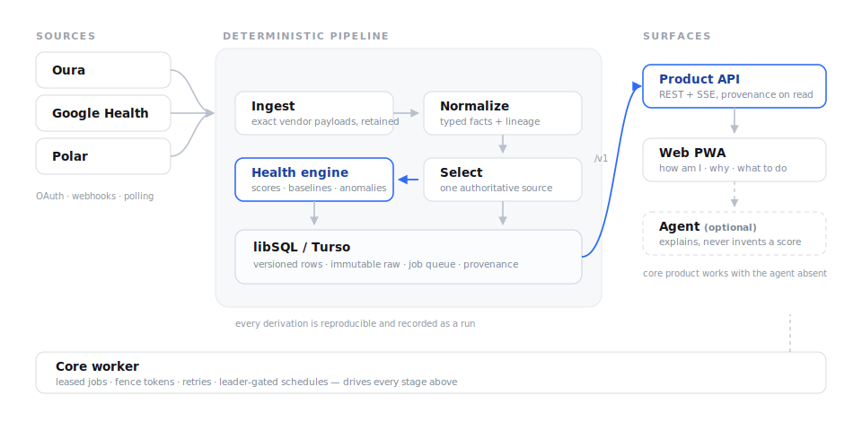

# Akunaki

A single-user health intelligence backend. It syncs wearable data from Oura, Google
Health, and Polar, normalizes it into typed facts with full lineage, selects one
authoritative source per metric, and runs a **deterministic** engine that produces
recovery scores, baselines, and anomalies — every result reproducible and traceable
back to the raw payload it came from.

  

## How it works

1. **Sources** — the user links Oura / Google Health / Polar over least-privilege OAuth. Data arrives via provider webhooks, incremental sync, and scheduled reconciliation.
2. **Ingest** — exact vendor payloads are retained immutably; nothing is discarded or silently overwritten.
3. **Normalize** — raw bodies become typed health facts carrying units, timezone, quality, and lineage.
4. **Select** — one authoritative source is chosen per metric family. No averaging, no silent fallback; alternatives are kept as inspectable candidates.
5. **Health engine** — a pure, deterministic core computes features, baselines, recovery scores, and anomalies. Same inputs always yield the same output.
6. **Serve** — the `/v1` product API answers *how am I / why / what should I do*, with an opaque provenance handle on every score. An **optional** agent can explain results but can never invent one — the product works fully with it absent.

Everything above is driven by the **core worker**: leased jobs, fence tokens, retries, and leader-gated schedules.

## Status

Partial Phase Zero + phase-one/two slices. This repository is primarily documentation
plus a working backend foundation (model-free FastAPI + local libSQL/Turso storage).
For an honest implemented / tested / pending breakdown, see
[`docs/implementation-status.md`](docs/implementation-status.md).

## Docs

- [Documentation index](docs/README.md)
- [Architecture overview](docs/architecture/overview.md)
- [Backend setup, test, run](backend/README.md)
