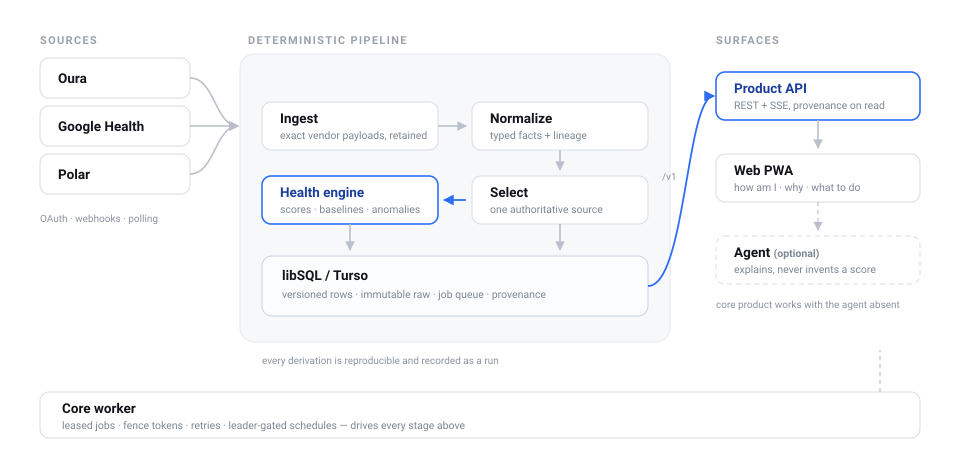

# Akunaki 飽くなき

A single-user health intelligence backend. It syncs wearable data from Oura, Google
Health, and Polar, normalizes it into typed facts with full lineage, selects one
authoritative source per metric, and runs a **deterministic** engine that produces
recovery scores, baselines, and anomalies — every result reproducible and traceable
back to the raw payload it came from.

  

## How it works

1. **Sources** — the user links Oura / Google Health / Polar over least-privilege OAuth. Data arrives via provider webhooks, incremental sync, and scheduled reconciliation.
2. **Ingest** — exact vendor payloads are retained immutably; nothing is discarded or silently overwritten.
3. **Normalize** — raw bodies become typed health facts carrying units, timezone, quality, and lineage.
4. **Select** — one authoritative source is chosen per metric family. No averaging, no silent fallback; alternatives are kept as inspectable candidates.
5. **Health engine** — a pure, deterministic core computes features, baselines, recovery scores, and anomalies. Same inputs always yield the same output.
6. **Serve** — the `/v1` product API answers *how am I / why / what should I do*, with an opaque provenance handle on every score. An **optional** agent can explain results but can never invent one — the product works fully with it absent.

Everything above is driven by the **core worker**: leased jobs, fence tokens, retries, and leader-gated schedules.

## Status

A working, deployable backend — model-free FastAPI over local libSQL, with the
ingest → normalize → select → score pipeline running end to end against real
provider data. All three connectors (Oura, Polar, Google Health) sync, and the
`/v1` product surface plus the `/v1/tools` registry are live.

Not everything in `docs/architecture/` is built: those documents describe the
target design and are marked **Proposed**, while `docs/operating/` describes
only what the code actually does. For an honest implemented / tested / pending
breakdown, see [`docs/implementation-status.md`](docs/implementation-status.md).

There is no frontend yet, and the optional agent layer is deliberately absent —
the deterministic core carries no model SDK, which CI enforces.

## Docs

**Running it**

- [Operating guide](docs/operating/README.md) — deploy, configure, integrate
- [Backend setup, test, run](backend/README.md)

**Understanding it**

- [Documentation index](docs/README.md)
- [Architecture overview](docs/architecture/overview.md)
- [Implementation status](docs/implementation-status.md) — what is built vs. designed

## Engineering

Single `master` branch, gated by CI on every push: ruff lint + format, mypy
`strict`, import-linter architecture contracts, the full test suite under a
branch-coverage floor, migrations proven `up → down → base → up` on an ephemeral
database, and a core-only install that asserts no model SDK is importable.

Python is pinned to 3.13.14 exactly (3.14 segfaulted with `sqlalchemy-libsql`
and is rejected until the stack is re-validated).
